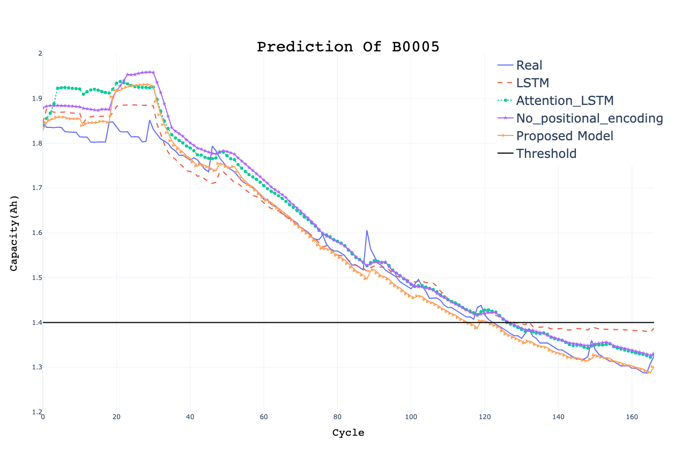
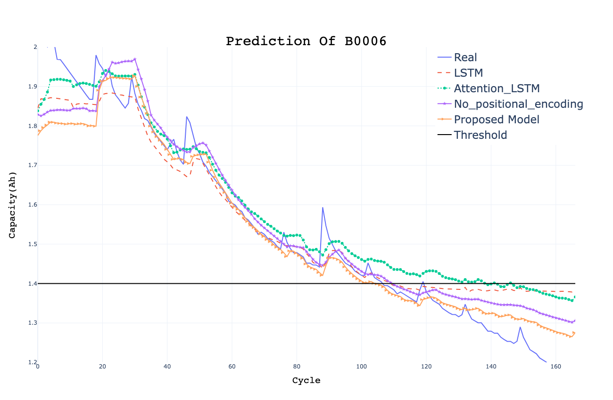
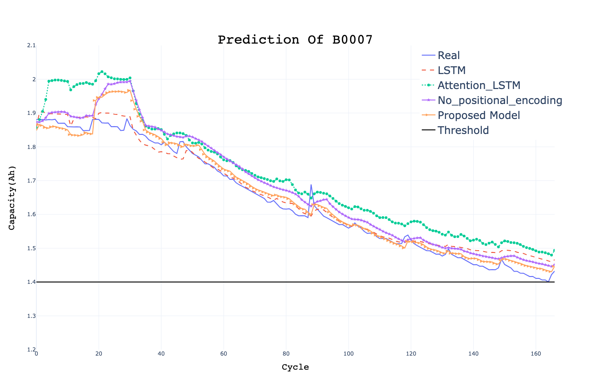
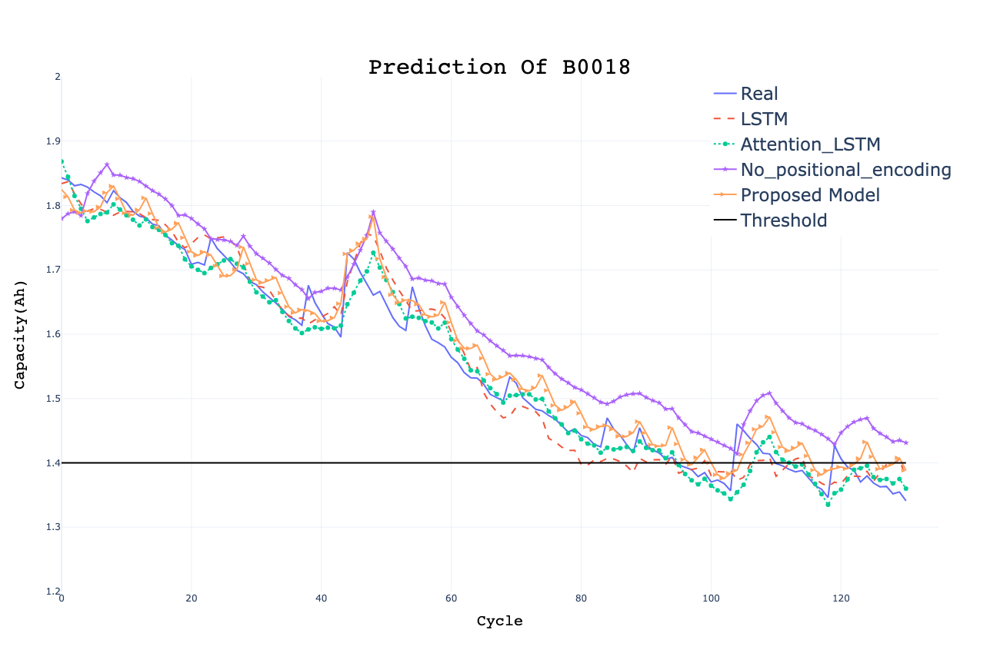

## Lithium-ion Battery SoH Prediction : Using Transformer Encoder Structure
### latest version : 2024/06/30 by JuYeon

### 📌 Description
- 트랜스포머 인코더 구조인 Positinal Endoing(PE)와 Multi-Head Attention(MAttn)를 활용하여 리튬 이온 배터리 용량을 예측
- Huristic한 방법으로 MAttn layer의 사용 개수를 설정
- PE를 사용하지 않은 모델도 실험
- Data from **NASA PCoE**(https://www.nasa.gov/intelligent-systems-division/discovery-and-systems-health/pcoe/pcoe-data-set-repository/)
- Use **charging** datas and capacity data
- Framework : **PyTorch**
- model type : Transformer Encoder structure / Multie-head Attention + LSTM / LSTM
- (https://github.com/SierraJY/NASA-Li-ion-BATTERY) 후속 연구

### 📌 Result
- LSTM에 보다 , 제안 모델이 40Cycle 이후 더 나은 예측 결과를 도출
- End of Life(EoL)이 지나거나 재활용된 리튬 이온 배터리에 적합할 것으로 기대

### 📌 Directorys & Files
- DATA/RAW : raw data (**.mat** files)
- DATA/DataFrame : extracted charge and capacity data ( **.csv** files )

- Train_SCModels : training Models using B0006/B0007/B0018's voltage data only & Predict B0005's capacity (single-channel)
- Train_MCModels : training Models using B0006/B0007/B0018's voltage, current, temperature & Predict B0005's capacity (multi-channel)
- Train_Other_MCModels : Predict Other Cells (EX: train B0005/B0007/B0018 & Predict B0006)

- BEST_MODEL : parameters of best models ( **.pt** files)
- PREDICT_B0005 : prediction of B0005's capacity
- PREDICTION_PLOP : B0005, B0006, B0007, B0018에 대한 모든 예측 시각화

### 📌 Conclusion

